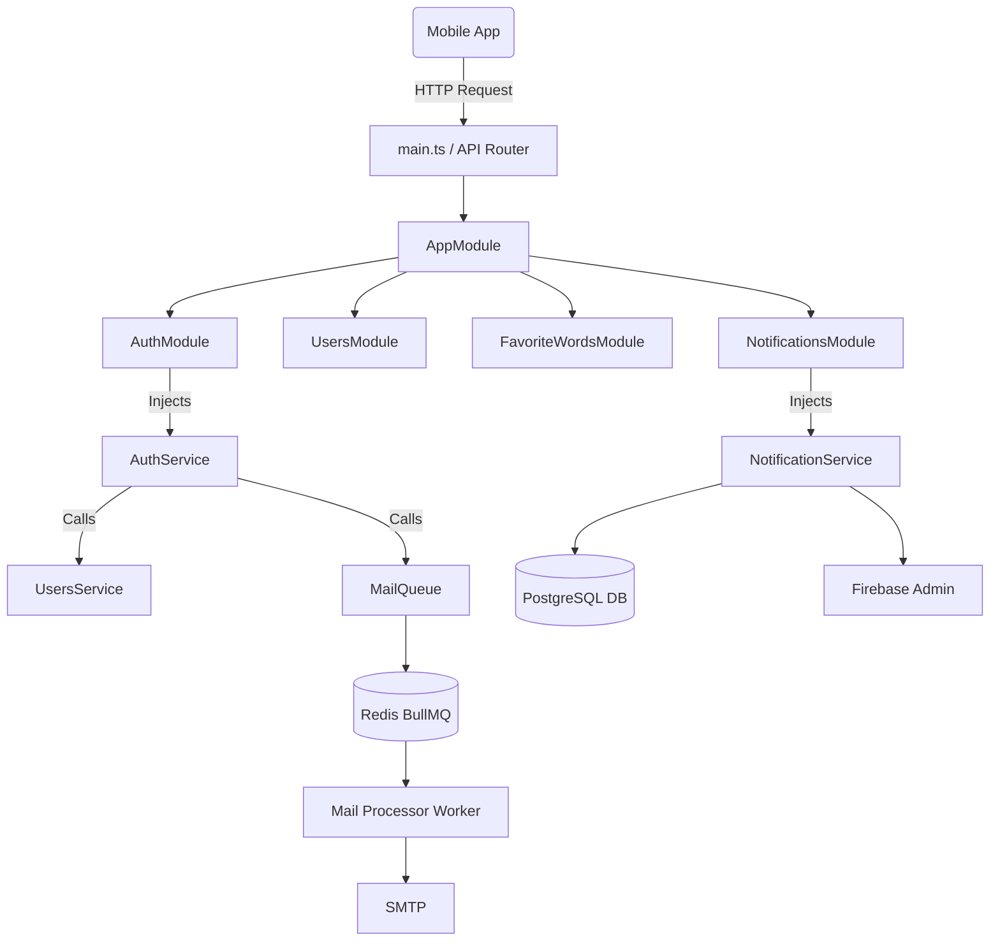
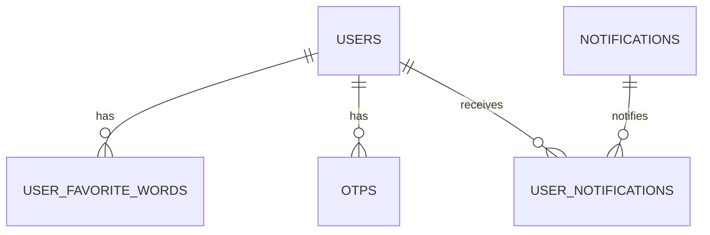

# Wasla Backend API

## Table of Contents
1. [Project Overview](#1-project-overview)
2. [Technologies Used](#2-technologies-used)
3. [Project Structure](#3-project-structure)
4. [Architecture](#4-architecture)
5. [Request Flow](#5-request-flow)
6. [Module Documentation](#6-module-documentation)
7. [Authentication](#7-authentication)
8. [Authorization](#8-authorization)
9. [API Documentation](#9-api-documentation)
10. [DTO Documentation](#10-dto-documentation)
11. [Database Documentation](#11-database-documentation)
12. [Services Layer](#12-services-layer)
13. [Middleware](#13-middleware)
14. [Guards](#14-guards)
15. [Interceptors](#15-interceptors)
16. [Exception Filters](#16-exception-filters)
17. [Validation](#17-validation)
18. [Configuration](#18-configuration)
19. [External Integrations](#19-external-integrations)
20. [Logging](#20-logging)
21. [Error Handling](#21-error-handling)
22. [Security](#22-security)
23. [Installation](#23-installation)
24. [Development Guide](#24-development-guide)
25. [Troubleshooting](#25-troubleshooting)
26. [Future Improvements](#26-future-improvements)
27. [Conclusion](#27-conclusion)

---

## 1. Project Overview

The **Wasla Backend API** provides the core infrastructure and business logic for the Wasla mobile application. 
The API is responsible for managing users, handling authentication (including Google OAuth), managing user favorite words, processing in-app and push notifications, and dealing with asynchronous tasks such as sending emails.

**Main Business Goals:**
- Provide a robust and scalable REST API for the mobile clients.
- Ensure secure user authentication and authorization.
- Support internationalization (i18n) for multiple languages (AR, EN).
- Handle background tasks (emails, push notifications) efficiently using queues to prevent blocking API requests.

---

## 2. Technologies Used

| Technology | Role / Purpose |
|------------|---------------|
| **NestJS** | The core Node.js framework providing a modular architecture. |
| **TypeScript** | Ensures type safety across the entire application. |
| **PostgreSQL** | The primary relational database storing all structured application data. |
| **TypeORM** | Object-Relational Mapper used to interact with PostgreSQL via entities. |
| **Redis & BullMQ** | Used for managing message queues (background processing for emails and notifications). |
| **Passport & JWT** | Used for managing authentication strategies and token issuance/verification. |
| **Firebase Admin SDK** | Integrated to send push notifications to mobile devices. |
| **Nodemailer** | Handles sending emails (e.g., OTPs) via an SMTP relay (Brevo). |
| **Google Auth Library** | Verifies Google OAuth tokens for social login. |
| **nestjs-i18n** | Handles request translations and localization responses. |
| **Swagger** | Auto-generates API documentation. |
| **class-validator / class-transformer** | Validates and transforms incoming request payloads against DTO schemas. |

---

## 3. Project Structure

```text
src/
├── common/             # Shared resources across the app
│   ├── decorators/     # Custom decorators (@CurrentUser, @Roles)
│   ├── dto/            # Shared Data Transfer Objects (e.g., PaginationDto)
│   ├── guards/         # Auth, Roles, and Throttle guards
│   ├── interceptors/   # Logger and Serialize interceptors
│   ├── types/          # Shared TypeScript interfaces/types
│   └── utils/          # General utilities (e.g., Logger module)
├── config/             # Application configuration files
├── database/           # DB Migrations, seeds, and TypeORM DataSource
├── i18n/               # Translation JSON files (en, ar)
├── modules/            # Business Logic Domains
│   ├── auth/           # Authentication endpoints and logic
│   ├── favorite-words/ # Favorite words management
│   ├── firebase/       # Firebase initialization and push notifications
│   ├── jobs/           # Scheduled cron jobs
│   ├── mail/           # Email rendering and sending logic
│   ├── notifications/  # In-app notifications
│   ├── otp/            # OTP generation and tracking
│   ├── queues/         # BullMQ queue processors (mail-queue, notification-queue)
│   └── users/          # User profile management and admin APIs
├── app.module.ts       # Root module importing everything
└── main.ts             # Application entry point
```

---

## 4. Architecture

The API uses a **Modular Architecture** enforced by NestJS.
- **Controllers** handle HTTP routing and delegate logic to services.
- **Services (Providers)** contain the business logic.
- **Entities** represent database tables.
- **Repositories** (via TypeORM) handle database interactions.
- **Dependency Injection** connects services, repositories, and controllers natively.

### Architecture Diagram



---

## 5. Request Flow

1. **Client** makes an HTTP Request.
2. **ThrottlerGuard** checks rate limits (if applicable to the route).
3. **CORS / Versioning** is processed globally.
4. **AuthGuard** validates the JWT Token and extracts user identity.
5. **RolesGuard** checks if the user has the required permissions to access the route.
6. **ValidationPipe** checks the request body/query against `class-validator` rules in the DTO.
7. **Controller** receives the validated data and calls the respective Service.
8. **Service** executes business logic, potentially interacting with TypeORM repositories or Queues.
9. **Interceptor** formats the response, stripping out sensitive data (e.g., `SerializeInterceptor` removes passwords) and logs execution time (`LoggerInterceptor`).
10. **Response** is returned to the Client.

---

## 6. Module Documentation

- **AuthModule**: Handles user registration, login, JWT issuance, Google login, and OTP-based password recovery.
- **UsersModule**: Manages user profiles, role mapping, avatar updates, and administrative user fetching.
- **FavoriteWordsModule**: CRUD operations for user-specific favorite words.
- **FirebaseModule**: Wrapper around `firebase-admin` to send push notifications.
- **JobsModule**: Uses `@nestjs/schedule` for background cron jobs.
- **MailModule**: Deals with email templates and dispatching via Nodemailer.
- **NotificationsModule**: Saves in-app notifications and associates them with users.
- **OtpModule**: Generates and validates OTP codes.
- **QueuesModule**: Contains sub-modules (`mail-queue`, `notification-queue`) that provide BullMQ processors to handle tasks asynchronously.

---

## 7. Authentication

Authentication is primarily handled via **JWT (JSON Web Tokens)**.

**Flows:**
- **Local Signup:** User submits email/password -> User is created (unverified) -> OTP is sent to email -> User verifies OTP to become active.
- **Local Login:** Validates credentials -> Issues `access_token` and `refresh_token`.
- **Google Login:** Validates Google token using `google-auth-library` -> Finds or creates user -> Issues tokens.
- **Forgot/Reset Password:** Sends OTP to email -> Verifies OTP to return a temporary `reset_token` -> Resets password using `reset_token`.
- **Refresh Token:** Exchanges a valid refresh token for a new access/refresh token pair.

---

## 8. Authorization

Authorization is Role-Based using the `@Roles` decorator and the `RolesGuard`.

**Implemented Roles:**
- `UserRole.USER`: Standard application user.
- `UserRole.ADMIN`: Administrator with elevated privileges.

If a route is decorated with `@Roles(UserRole.ADMIN)`, the `RolesGuard` ensures the JWT payload contains the `admin` role before granting access.

---

## 9. API Documentation

*Note: A complete interactive documentation is available via Swagger at `http://localhost:<PORT>/api/docs` (in non-production environments).*

### Example Endpoints:

| Method | Endpoint | Description | Auth Required |
|--------|----------|-------------|---------------|
| `POST` | `/api/v1/auth/signup` | Register a new user | No |
| `POST` | `/api/v1/auth/login` | Authenticate user & get JWT | No |
| `POST` | `/api/v1/auth/google-login` | Authenticate via Google | No |
| `GET` | `/api/v1/users/me` | Get current user profile | Yes (User) |
| `PATCH`| `/api/v1/users/update-profile` | Update profile data | Yes (User) |
| `GET` | `/api/v1/favorite-words/my-words`| Get user's favorite words | Yes (User) |
| `POST` | `/api/v1/favorite-words` | Add a new favorite word | Yes (User) |

---

## 10. DTO Documentation

Data Transfer Objects define the shape of data over the network and include validation decorators (`@IsString()`, `@IsEmail()`, etc.).

- **CreateUserDto**: Requires `name`, `email`, `password`.
- **UpdateUserDto**: Optional fields to update `name`, `phone`, `preferredLanguage`.
- **PaginationDto**: Accepts `page` and `limit` for paginated queries.
- **SetUserFirebaseTokenDto**: Accepts `firebaseToken` and `deviceId`.
- **UpdatePasswordDto**: Requires `oldPassword` and `newPassword`.

---

## 11. Database Documentation

Database: **PostgreSQL** via **TypeORM**.

**Key Entities (Tables):**
- `users`: Core identity table. Includes columns for OAuth `provider`, `providerId`, `role`, and `isVerified`.
- `user_favorite_words`: Stores words users have marked as favorites. Links back to `users` via ManyToOne.
- `notifications`: Global notifications metadata (supports translations via `title_translations` jsonb).
- `user_notifications`: Pivot/Join table mapping `notifications` to `users` and tracking `isRead` status.
- `otps`: Stores ephemeral OTPs mapped to users, including expiration dates.



---

## 12. Services Layer

Services contain isolated business logic:
- `AuthService`: Password hashing, token generation, Google Auth verification.
- `UsersService`: DB interactions to find, create, and update User models.
- `FavoriteWordsService`: Logic to check if a word is already favorited and managing entries.
- `MailQueueProcessor`: Consumes jobs from Redis to send emails asynchronously without making the user wait for the SMTP server response.

---

## 13. Middleware

No custom middlewares are implemented. 
The application relies on built-in NestJS/Express middlewares for:
- CORS (`app.enableCors()`)
- Versioning (`app.enableVersioning()`)
- Body Parsing

---

## 14. Guards

- **AuthGuard**: Extracts the bearer token from the header, verifies it using `JwtService`, and attaches the decoded payload to `request.user`.
- **RolesGuard**: Checks if `request.user.role` matches the required roles specified by the `@Roles()` decorator.
- **ThrottleGuard**: Protects the API against brute-force attacks by limiting the number of requests a single IP can make within a time window.

---

## 15. Interceptors

- **LoggerInterceptor**: Intercepts incoming requests, logs the method and URL, measures execution time, and logs the result when the response is sent.
- **SerializeInterceptor**: Intercepts the outgoing response and maps the returned data entity to a safe DTO (e.g., `UserDto`) to ensure passwords or sensitive fields never leak to the client.

---

## 16. Exception Filters

The project uses the **Global NestJS Exception Filter**.
Validation errors are automatically caught by the global `ValidationPipe` and transformed into `400 Bad Request` responses with detailed arrays of validation failures. Unhandled internal errors result in a `500 Internal Server Error`.

---

## 17. Validation

All incoming payloads are validated using the global `ValidationPipe` configured in `app.module.ts`:
```typescript
{
    provide: APP_PIPE,
    useValue: new ValidationPipe({
        whitelist: true, // Strips fields not defined in the DTO
    }),
}
```

---

## 18. Configuration

Environment variables are loaded via `@nestjs/config`. A `.env` file is required in the root directory.

| Variable | Purpose |
|----------|---------|
| `PORT` / `APP_URL` | Application binding port and external URL. |
| `DB_HOST`, `DB_PORT`, `DB_USER`, `DB_PASSWORD`, `DB_NAME` | PostgreSQL credentials. |
| `JWT_SECRET`, `JWT_EXPIRES_IN`, `REFRESH_TOKEN_*`, `RESET_TOKEN_*` | Keys and expirations for tokens. |
| `REDIS_HOST`, `REDIS_PORT`, `REDIS_DB` | Redis connection for BullMQ. |
| `MAIL_HOST`, `MAIL_PORT`, `MAIL_USER`, `MAIL_PASSWORD`, `MAIL_FROM` | SMTP (Brevo) configuration for Nodemailer. |
| `GOOGLE_CLIENT_ID` | Required to verify tokens received from mobile Google Login. |
| `FIREBASE_PROJECT_ID`, `FIREBASE_PRIVATE_KEY`, `FIREBASE_CLIENT_EMAIL` | Credentials for Firebase Admin SDK. |

---

## 19. External Integrations

1. **Google OAuth**: Validates identity tokens generated by the mobile client using `google-auth-library`.
2. **Brevo (Sendinblue)**: Integrated via standard SMTP using Nodemailer to dispatch transactional emails (OTPs).
3. **Firebase Cloud Messaging (FCM)**: Configured using `firebase-admin` to send push notifications to devices identified by `firebaseToken`.

---

## 20. Logging

Logging is handled via:
- Built-in `Logger` from `@nestjs/common`.
- Custom `LoggerInterceptor` tracking every HTTP request method, path, and duration.

---

## 21. Error Handling

- **Validation Errors:** Handled by `ValidationPipe`.
- **HTTP Errors:** Manually triggered using `throw new HttpException(...)`, `throw new BadRequestException()`, or `throw new UnauthorizedException()`.
- **Global Error Catching:** NestJS catches unhandled errors, preventing the server from crashing and returning formatted error responses.

---

## 22. Security

- **JWT Auth**: Stateless token authentication.
- **Bcrypt**: Passwords are securely hashed before saving to PostgreSQL.
- **CORS**: Configured in `main.ts` to control domain access.
- **Rate Limiting**: `ThrottlerModule` is configured (30 requests per 60 seconds).
- **DTO Whitelisting**: Drops extra payload parameters to prevent malicious data injection.

---

## 23. Installation

**Prerequisites:**
- Node.js (v18+)
- PostgreSQL Server
- Redis Server

**Steps:**
1. Clone the repository.
2. Install dependencies:
   ```bash
   npm install
   ```
3. Copy `.env.example` (or configure based on documentation) to `.env` and fill in credentials.
4. Run TypeORM Migrations to set up tables:
   ```bash
   npm run db:run
   ```
5. Run the application:
   ```bash
   npm run start:dev  # Development mode (watch)
   npm run build && npm run start:prod # Production mode
   ```

---

## 24. Development Guide

- **Adding a Module:** Use the Nest CLI: `npx nest g module modules/feature-name`
- **Adding a Controller/Service:** `npx nest g controller modules/feature-name`
- **Database Changes:** 
  1. Modify/Create your `.entity.ts` file.
  2. Generate a migration: `npm run db:generate --name=MigrationName`
  3. Run the migration: `npm run db:run`
- **Translations:** Add your key-value pairs in the JSON files under `src/i18n/`. Access them in controllers/services using `I18nService`.

---

## 25. Troubleshooting

- **Redis Error (ECONNREFUSED):** Ensure your Redis server is actually running locally or verify `REDIS_HOST`/`REDIS_PORT`. BullMQ will fail to start without Redis.
- **TypeORM Connection Refused:** Ensure PostgreSQL is running and `DB_PASSWORD` / `DB_USER` match your local setup.
- **Firebase Initialization Failure:** Ensure the `FIREBASE_PRIVATE_KEY` in your `.env` contains literal `\n` characters for newlines, or is properly quoted.
- **Validation Errors on valid payloads:** Ensure your JSON payload keys match the DTO properties exactly.

---

## 26. Future Improvements

*(Not Implemented Yet - Targeted for future releases)*
- **WebSockets / Socket.io:** For real-time updates inside the mobile application.
- **Redis Caching:** Cache frequently accessed data (e.g., global translations or configurations) instead of querying Postgres.
- **File Storage Service:** Integrate AWS S3 or Google Cloud Storage for avatar and media uploads instead of local storage.
- **Advanced Admin Dashboard APIs:** Extensive analytics, banning users, and content moderation APIs.

---

## 27. Conclusion

The Wasla Backend API leverages the power of NestJS to provide a modular, secure, and highly scalable architecture. By cleanly separating concerns into modules, utilizing background queues for heavy tasks, and enforcing strict data validation with TypeORM and DTOs, the codebase is designed to be easily extensible. New developers can quickly integrate by understanding the Request Flow, exploring the specific Modules in `src/modules`, and following standard NestJS conventions.
